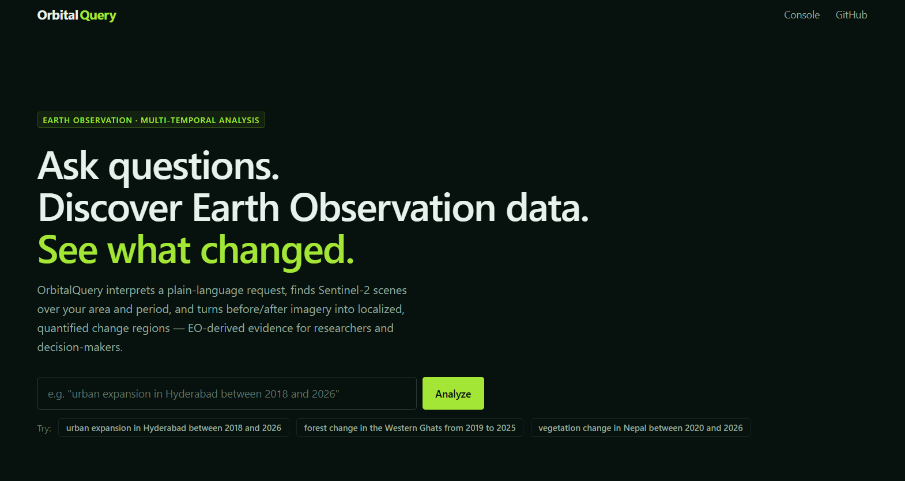
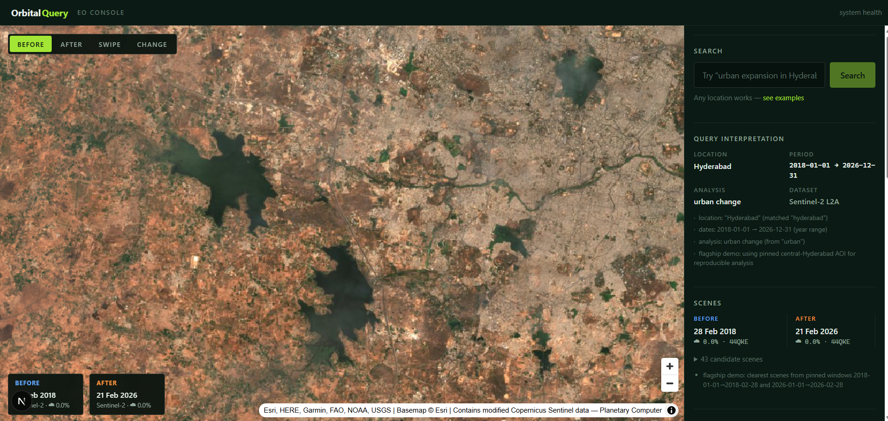
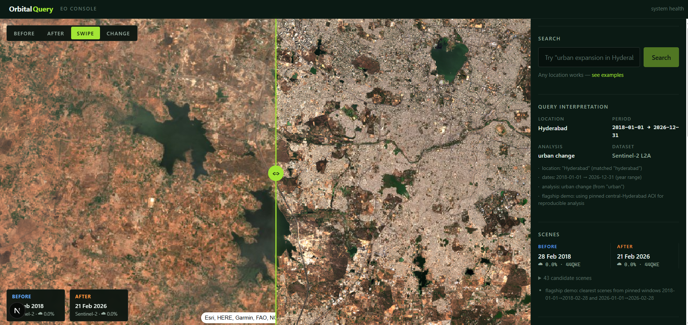
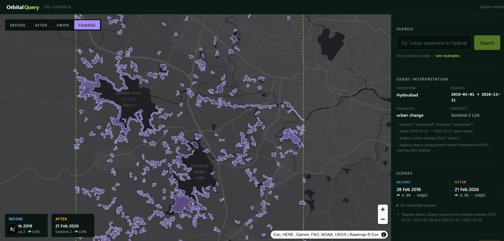
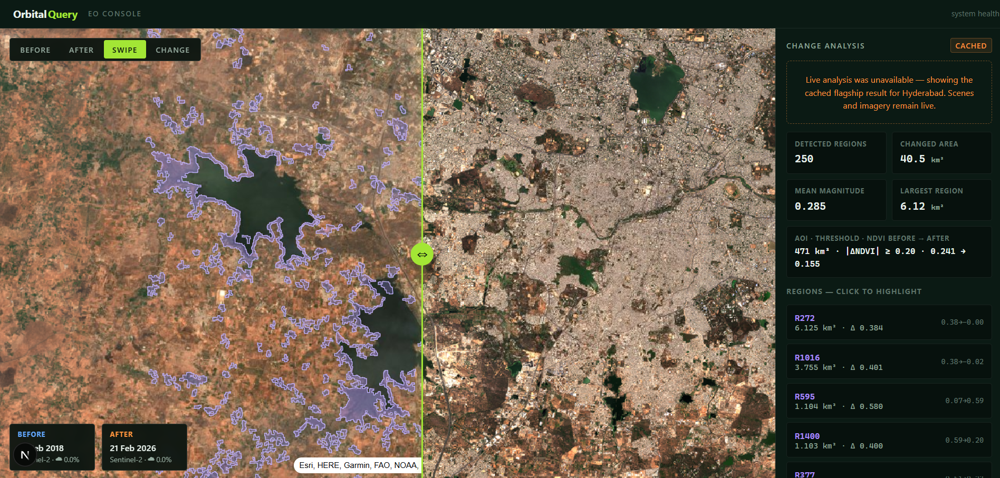

<div align="center">

# OrbitalQuery

**Ask questions. Discover Earth Observation data. See what changed.**

An EO discovery and multi-temporal analysis console — type a natural-language
request, get Sentinel-2 before/after imagery and quantified land-change evidence.


</div>

---



OrbitalQuery interprets a plain-language request such as

> *"urban expansion in Hyderabad between 2018 and 2026"*

then discovers relevant Sentinel-2 scenes, renders **before / after imagery** on an
interactive map, detects **localized land change**, and reports quantitative evidence —
changed area, per-region NDVI shift, and clickable change polygons.

> **Honest positioning.** EO-derived change regions are *evidence to support review*,
> not validated ground truth. OrbitalQuery is a discovery and analysis tool — not an
> emergency-response system, and it makes no accuracy guarantees.

## How it works

```
 01 DESCRIBE          02 DISCOVER           03 COMPARE             04 QUANTIFY
 natural-language  →  Planetary Computer  →  before/after map   →  localized change
 request              STAC scene search      + working swipe        regions + statistics
```

Under the hood:

```
Browser (Next.js + MapLibre GL)
  → Next.js API routes
      → Planetary Computer STAC        (scene discovery; tile URLs stream
      → Cloud Run analysis service      straight to the browser — no full
        (Python · rasterio · NDVI)      raster downloads, ever)
  → GeoJSON change regions + statistics
→ Map UI
```

The browser never talks to the Python service directly. Analysis clips to the
requested AOI *before* any expensive raster work and streams only that window of
each band via COG range requests.

## Screenshots

The flagship demo — *urban expansion in Hyderabad, 2018 → 2026* — in the four map
modes:

**BEFORE** — the selected Sentinel-2 scene for the earlier date, with the parsed
query interpretation (location, period, analysis, dataset) in the sidebar:



**SWIPE** — seasonally-matched before/after scenes on a synced overlay with a
draggable divider:



**CHANGE** — localized NDVI change regions rendered as polygons, not a global mask:



**Quantified evidence** — per-analysis statistics (detected regions, changed area,
mean magnitude, largest region) and a clickable per-region list. Shown here serving
the transparent cached fallback after live analysis was unavailable — the imagery
and scenes stay live:



## Features

- **Natural-language queries** — deterministic parsing of location, date range, and
  requested analysis (`urban change`, `vegetation change`, `land use change`); any
  location works, not just presets
- **Scene selection that respects the data** — cloud-cover filtering, AOI coverage
  checks, same-MGRS-tile pairing, and anniversary dating so before/after scenes are
  seasonally matched
- **Four map modes** — BEFORE / AFTER / SWIPE (a real synced overlay with a
  draggable divider) / CHANGE (localized polygons, not a global mask)
- **Quantified change regions** — NDVI difference ≥ 0.20 threshold, morphological
  cleanup, connected components, per-region area + magnitude + before→after NDVI;
  click a region to highlight it on the map
- **Demo-grade reliability** — every async operation has loading, timeout, error,
  and fallback states. The flagship demo falls back to a real cached analysis result
  (computed from the same pipeline, never fake data) if the live service fails

## Available searches

Fifteen curated example regions — each one is just metadata fed through the same
generalized pipeline as a typed query:

| CITIES | REGIONS | CHANGE & RISK |
|---|---|---|
| Hyderabad ★ (flagship) | Western Ghats | Nepal |
| Mumbai | Himalayan Belt | Kathmandu Valley |
| Delhi NCR | Thar Desert | Uttarakhand |
| Jaipur | Sundarbans | Brahmaputra Basin |
| Dehradun | | Northeast India |
| Srinagar | | |

…or search **any location on Earth** — free-text queries are geocoded and run
through the identical pipeline.

## Quickstart

Prereqs: **Node 20+**, **Python 3.12+**. No API keys required — Planetary Computer's
STAC API and tile endpoints are public.

```bash
# 1 — Web console (terminal 1)
cd apps/web
npm install
cp .env.example .env.local      # local defaults are fine
npm run dev                     # → http://localhost:3000

# 2 — Analysis service (terminal 2)
cd services/analysis
pip install -r requirements.txt
python -m uvicorn app.main:app --port 8000 --reload
```

Open http://localhost:3000, type the flagship query, hit **Run change analysis**.

> Without the Python service running, everything except live analysis still works —
> search, scenes, map, and swipe — and the flagship Hyderabad demo serves its cached
> result transparently (marked **cached** in the UI).

## Environment variables

| Variable | Where | Local default | Production |
|---|---|---|---|
| `PLANETARY_COMPUTER_STAC_URL` | web | `https://planetarycomputer.microsoft.com/api/stac/v1` | same |
| `ANALYSIS_SERVICE_URL` | web (server-side only) | `http://localhost:8000` | **must** be the Cloud Run URL |
| `NEXT_PUBLIC_APP_URL` | web | `http://localhost:3000` | your deployed URL |

No secrets exist in this project. `ANALYSIS_SERVICE_URL` is never exposed to the
browser. See [`apps/web/.env.example`](apps/web/.env.example) and
[`services/analysis/.env.example`](services/analysis/.env.example).

## Testing

```bash
cd apps/web && npm test                   # 42 tests: parser, presets, selection, validation
cd services/analysis && python -m pytest  # 32 tests: NDVI, change, geojson, stats, API
bash scripts/e2e_check.sh                 # full-stack smoke incl. fallback-on-failure
```

The E2E script boots both services, runs the flagship flow plus failure cases
(invalid queries, service-down, cached fallback), and reports a pass/fail summary.

## Method

```
NDVI   = (B08 − B04) / (B08 + B04)
change = |ΔNDVI| ≥ 0.20   (configurable) + morphological cleanup
```

Scenes come from **Sentinel-2 Level-2A** on the
[Microsoft Planetary Computer](https://planetarycomputer.microsoft.com/dataset/sentinel-2-l2a).
Full methodology and data flow: [docs/ARCHITECTURE.md](docs/ARCHITECTURE.md).

## Project structure

```
apps/web                     Next.js 15 + TypeScript + MapLibre GL console
  app/api/                   search · scenes · analysis · health routes
  components/                map · search · analysis · ui
  lib/                       queryParser · stac · sceneSelection · demoCache
  public/demo/hyderabad/     flagship fallback result (real cached analysis)
services/analysis            FastAPI + rasterio NDVI change service (Cloud Run)
scripts/                     demo-cache builder · E2E smoke check
docs/                        ARCHITECTURE · API · DEPLOYMENT
```

## Documentation

| Doc | Contents |
|---|---|
| [docs/ARCHITECTURE.md](docs/ARCHITECTURE.md) | data flow, change-detection pipeline, fallback behavior |
| [docs/API.md](docs/API.md) | endpoint contracts for web + analysis service |
| [docs/DEPLOYMENT.md](docs/DEPLOYMENT.md) | Vercel + Cloud Run deployment, pre-demo checklist |

## Scope

Deliberately **excluded** to keep the tool deterministic and reliable:
authentication, databases, chat history, Sentinel-1 processing, custom tile
servers, large raster storage, and real-time telemetry.

## License

[MIT](LICENSE) © 2026 Saatvik Raghuvanshi
